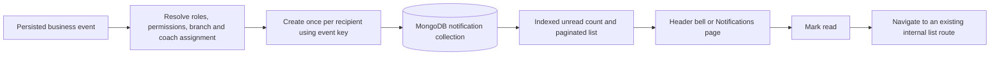

# ForceStrike Notification System — Implementation Report

## Summary

The repository had no database-backed notification feature. The header bell was a decorative button with a dot, while `NotificationProvider` displayed temporary toast messages only. The application already uses MongoDB/Mongoose, HttpOnly session cookies, database-backed role permissions, `User.branch`, and `Role.dataScope`; the notification implementation follows those existing patterns.

The notification center now supports persistent personal notifications, indexed unread counts, pagination, read state, event-key deduplication, branch/permission-aware recipient resolution, a bell popover, a full notifications page, and a 90-day retention policy.

## Implemented behavior

- Notifications are stored in MongoDB with controlled types and severities, recipient, branch/student/entity references, an internal action URL, optional small metadata, read state, timestamps, and expiry.
- Event recipients are resolved from active users whose current database role has the relevant permission. Super Admin remains included. Branch-scoped users are limited to their assigned branch; coaches are additionally limited to students assigned to them.
- Reads and mutations are scoped to the authenticated user. Reads also filter by the user's current branch scope and permissions. A notification belonging to another user or outside the caller's access returns not found.
- Business event notifications use a unique `(recipient, eventKey)` index. Retried events do not create duplicate notifications.
- Notification persistence failures are logged and swallowed by the notification service so core writes such as attendance remain successful.
- A MongoDB TTL index removes notifications after 90 days. There is no cron job or additional dependency.
- The header bell loads the indexed unread count, refreshes on focus/visibility, shows a 99+ badge cap, and opens a recent-notifications popover. Notification clicks mark unread items as read and navigate only to validated internal routes.
- `/notifications` provides All/Unread views, pagination, read controls, loading/error/empty states, and responsive dark-mode-compatible styling.
- No WebSockets, SSE, email, SMS, or external notification service was introduced.

## Notification lifecycle

## Event integrations

| Event | Trigger | Recipient permission | Action route |
|---|---|---|---|
| `STUDENT_CREATED` | Student profile and linked account created | `student.view` | `/students` |
| `STUDENT_COMPLETED` | Student status transitions to `COMPLETED` | `student.view` | `/students` |
| `ATTENDANCE_ABSENT` | Regular attendance saved as absent | `attendance.view` | `/attendance?date=…` |
| `MAKEUP_CREATED` | Makeup recovery created | `makeup.view` | `/makeups` |
| `MAKEUP_SCHEDULED` | Makeup scheduled or rescheduled | `makeup.view` | `/makeups` |
| `MAKEUP_COMPLETED` | Makeup completion persisted | `makeup.view` | `/makeups` |
| `PROMOTION_ELIGIBLE` | Existing eligible-promotion query identifies an eligible milestone | `promotion.view` | `/promotions` |
| `PROMOTION_COMPLETED` | Promotion history persisted | `promotion.view` | `/promotions` |
| `INQUIRY_RECEIVED` | Inquiry successfully persisted | `inquiry.view` | `/inquiries` |

Present attendance does not create an attendance notification. Promotion eligibility continues to use the existing promotion calculation; the notification handler does not calculate progress independently. Eligibility notifications are first emitted when the existing eligible-promotions endpoint observes the candidate, and are deduplicated by student/program/milestone.

## API

Mounted at `/api/notifications` and protected by the existing session authentication middleware:

- `GET /` — newest-first list; supports `page`, `limit`, `read=true|false`, and controlled `type` filtering.
- `GET /unread-count` — indexed count query.
- `PATCH /:id/read` — mark the caller's accessible notification as read.
- `PATCH /read-all` — mark all of the caller's accessible notifications as read.

The API does not accept recipient IDs from clients and does not expose notification records from other users.

## Indexes and retention

Declared indexes:

- `(recipient, read, createdAt desc)` for unread/read listing and counts.
- `(recipient, createdAt desc)` for newest-first lists.
- `(recipient, branch, createdAt desc)` for recipient reads with branch scoping.
- `(entityType, entityId)` for notification-to-entity lookups.
- Unique partial `(recipient, eventKey)` for event idempotency.
- TTL `(expiresAt)` with `expireAfterSeconds: 0` for 90-day cleanup.

Production setup: from `server/`, configure the production `MONGO_URI` and run `npm run migrate:notification-indexes` before deployment. This creates the notification indexes without dropping unrelated indexes. No new application environment variables are required.

## Files changed

- `server/src/models/Notification.js`
- `server/src/services/notification.service.js`
- `server/src/controllers/notification.controller.js`
- `server/src/routes/notification.routes.js`
- `server/server.js`
- `server/src/controllers/attendance.controller.js`
- `server/src/controllers/makeup.controller.js`
- `server/src/controllers/inquiry.controller.js`
- `server/src/controllers/promotion.controller.js`
- `server/src/controllers/student.controller.js`
- `server/scripts/migrateNotificationIndexes.js`
- `server/package.json`
- `server/tests/integration/api.integration.test.js`
- `client/lib/notificationsApi.ts`
- `client/components/layout/Header.tsx`
- `client/app/notifications/page.tsx`
- `client/components/layout/RouteGuard.tsx`

## Verification

- `npm test` in `server/`: passed; 6 unit tests and 43 integration tests, 49 total.
- Integration coverage includes authenticated/user-specific reads, branch and permission isolation, unread counts, individual/bulk read state, pagination, invalid IDs, event deduplication, notification failure safety, absence behavior, makeup lifecycle, inquiry recipient scope, student-created/completed events, and notification indexes/TTL.
- ESLint on the changed frontend files: passed.
- `git diff --check` on changed files: passed (Git printed line-ending conversion notices only).
- JavaScript syntax checks on changed backend files: passed.
- Frontend TypeScript check: blocked by an existing duplicate `attendance` identifier in `client/app/students/[id]/progress/page.tsx` at lines 123 and 132. No notification files appeared in the typecheck errors.
- `npm run build` in `client/`: blocked while loading `next.config.ts` because the current environment does not provide a valid production `NEXT_PUBLIC_API_URL` using a real HTTPS hostname. Build did not reach compilation.
- No browser-based manual verification was run.

## Remaining production considerations

- Notification writes are deliberately best-effort to preserve core business operations. If MongoDB rejects a notification after the business event is saved, the error is logged but there is no durable outbox/retry worker; that notification can be missed until the source event is performed again.
- Promotion-eligibility notification creation is attached to the existing eligible-promotions read endpoint because the project has no persisted eligibility-transition event. It is idempotent, but the first observation may be delayed until an authorized user opens that area.
- A production frontend build and complete TypeScript verification require correcting the pre-existing progress-page duplicate identifier and supplying the actual production API hostname in the build environment.
